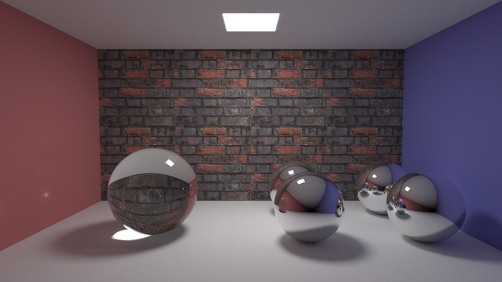
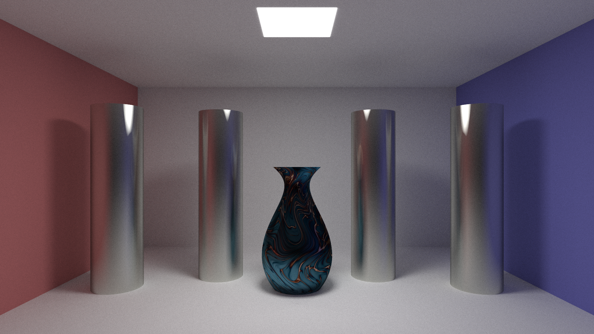
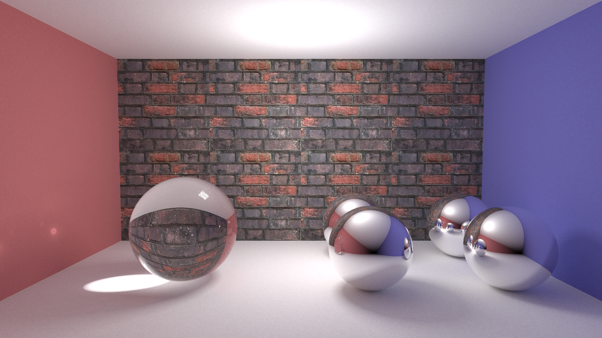
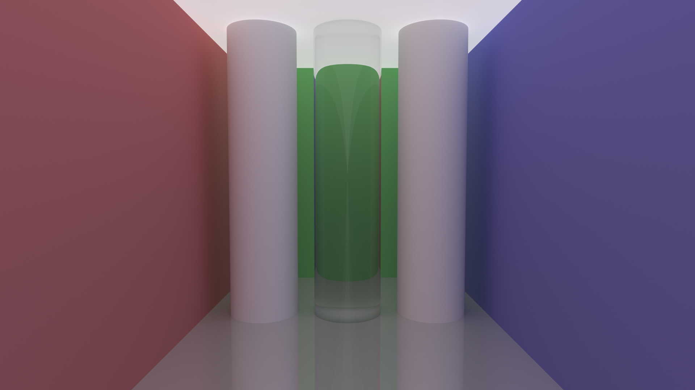
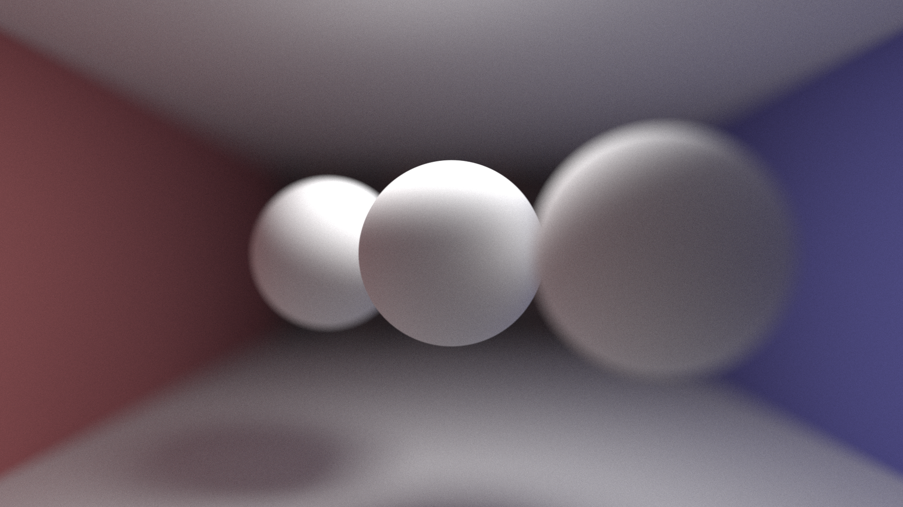
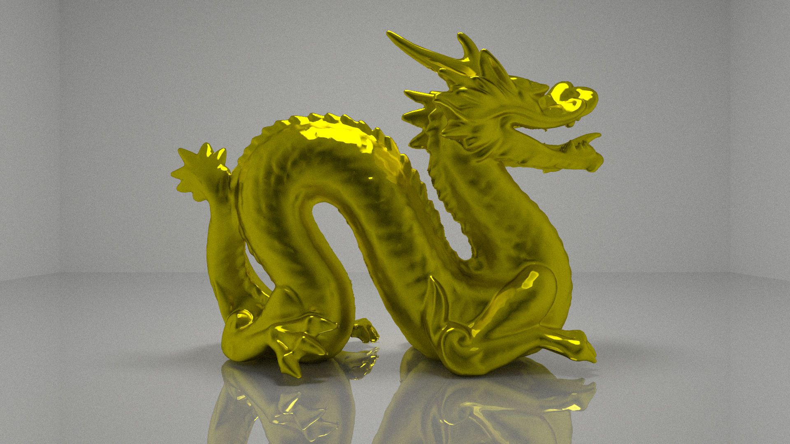
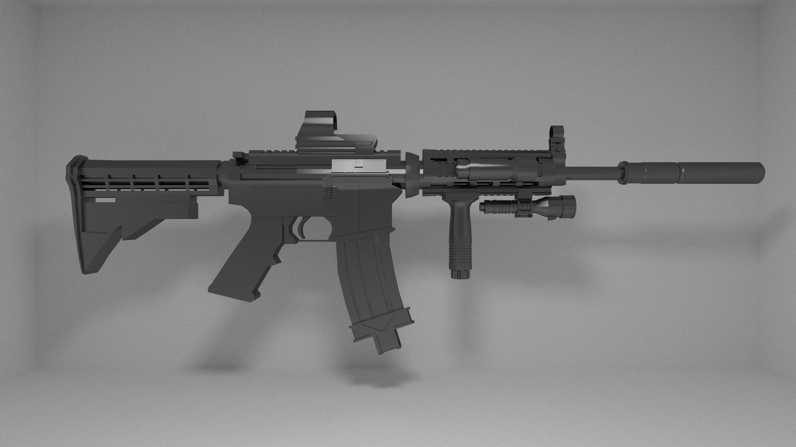
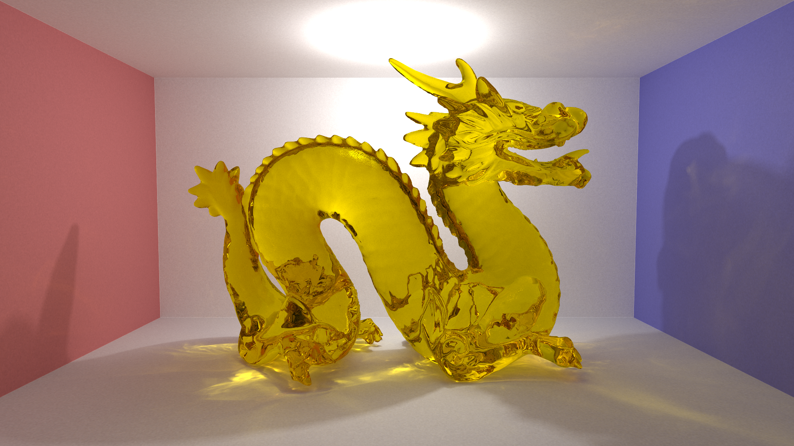

# Yet Another Raytracer

This is a raytracer written in 2.3k lines of C++.

Supported features:

- Algorithm
    1. Path tracing
    2. Stochastic progressive photon mapping (SPPM)

- Model
    1. Triangle, plane, sphere
    2. Bézier curve rotating around an axis (solved by Newton's method or triangulation)
    3. Triangle mesh (imported from `.obj` file)

- Material
    1. Lambert reflectance
    2. Speculative material
    3. Reflective and semi-reflective material
    4. Refractive material. Reflection rate calculated by Fresnel-Schlick formula

- Additional features
    1. Texture u-v mapping for mesh, plane, sphere and Bezier surface
    2. Normal interpolation based on barycentric coordinates
    3. Soft shadow produced by light source sampling
    4. Super-sampling for anti-aliasing
    5. Depth of field
    6. Intersection finding accelerated by AABB and BVH data structure
    7. OpenMP multi-threading

## Gallery

1. Reflective and refractive balls:
```shell
./build/RT -i scenes/cornell-2ball.yml -o output/final/cornell-2ball.bmp -p4 -s1024
```


2. Bezier curve:
```shell
./build/RT -i scenes/cornell-bezier.yml -o output/final/cornell-bezier.bmp -p4 -s512
```


3. Reflective and refractive balls (SPPM version)
```shell
./build/RT_sppm -i scenes/cornell-2ball.yml -o output/final/cornell-2ball-sppm.bmp -p 10000000 -n 50 -r 0.008
```


4. Color bleeding with path tracing
```shell
./build/RT -i scenes/bleeding.yml -o output/final/bleeding.bmp -p4 -s512
```


5. Depth of field
```shell
./build/RT -i scenes/cornell-depth.yml -o output/final/cornell-depth.bmp -p4 -s1024
```


6. Dragon (100k triangles)
```shell
./build/RT -i scenes/dragon.yml -o output/final/dragon.bmp -p4 -s512
```


7. M4A1 (100k triangles)
```shell
./build/RT -i scenes/m4a1.yml -o output/final/m4a1.bmp -p4 -s512
```


8. Caustic dragon with SPPM
```shell
./build/RT_sppm -i scenes/caustics.yml -o output/final/caustics.bmp -p 10000000 -n 50 -r 0.008
```


## File Hierarchy

```text
.
├── .gitignore                        # exclude some annoying files from git
├── assets                            # .obj, .mtl and textures, not included in this repo
├── CMakeLists.txt                    # yes, this project builds with CMake
├── LICENSE                           # GPL3 licence, use with care
├── Makefile                          # simply a script wrapper
├── README.md                         # what you are reading now
├── deps
│     └── vecmath                     # a tiny library for vector/matrix operation
├── results                           # output images (png and bmp)
├── scenes                            # scene description file stored in yaml
├── src                               # source code for our ray tracer
│     ├── core
│     │     ├── camera.cpp
│     │     ├── camera.h              # perspective camera with depth of field
│     │     ├── hit.cpp
│     │     ├── hit.h                 # light hit the object
│     │     ├── light.cpp
│     │     ├── light.h               # light sources emit rays
│     │     ├── material.cpp
│     │     ├── material.h            # providing a few kind of materials
│     │     ├── ray.cpp
│     │     ├── ray.h                 # emitted from camera, or from light source
│     │     ├── texture.cpp
│     │     └── texture.h             # uv mapping of texture
│     ├── objects
│     │     ├── bvh.cpp
│     │     ├── bvh.h                 # implementing BVH algorithm
│     │     ├── group.cpp
│     │     ├── group.h               # a collection of objects
│     │     ├── mesh.cpp
│     │     ├── mesh.h                # triangular mesh, powered by BVH
│     │     ├── obj_import.cpp
│     │     ├── obj_import.h          # import mesh from obj file
│     │     ├── object3d.h            # abstract base class of all objects
│     │     ├── plane.cpp
│     │     ├── plane.h               # infinite size plane
│     │     ├── rotate_bezier.cpp     # bezier curve rotating around an axis
│     │     ├── rotate_bezier.h
│     │     ├── sphere.cpp
│     │     ├── sphere.h              # sphere
│     │     ├── triangle.cpp
│     │     └── triangle.h            # triangle, supporting normal interpolation
│     ├── renderers
│     │     ├── path_tracing.cpp
│     │     ├── path_tracing.h        # implementing path tracing
│     │     ├── photon_mapping.cpp
│     │     └── photon_mapping.h      # implementing SPPM
│     ├── pt_main.cpp                 # main file for path tracing
│     ├── sppm_main.cpp               # main file for SPPM
│     └── utils
│         ├── aabb.cpp
│         ├── aabb.h                  # axis-aligned bounding box
│         ├── ball_finder.hpp         # a simple data structure to find spheres containing a point
│         ├── debug.h                 # some debugging/logging stuff
│         ├── image.cpp
│         ├── image.h                 # write image to file
│         ├── math_util.cpp
│         ├── math_util.h             # random number generator, and some misc math functions
│         ├── prog_bar.hpp            # showing progress bar for long-time rendering
│         ├── scene_parser.cpp
│         └── scene_parser.h          # parse scene from yaml file
└── tests                             # additional correctness tests
    ├── ball_finder_test.cpp
    └── bezier_intersection_test.cpp
```
## Compilation

Prerequisite:
1. CMake no older than 3.14
2. C++ compiler supporting C++17 and OpenMP
3. Network connection to GitHub (for automatic dependency fetching)

After cloning the repository:
```shell
mkdir build
cd build
cmake .. -DCMAKE_BUILD_TYPE=Release --target RT  # compile path tracer
cmake .. -DCMAKE_BUILD_TYPE=Release --target RT_sppm  # compile SPPM
```

Both binary requires a few command line arguments. Run with `--help` to find out.

## External Dependencies

1. `glog`: logging
2. `fmt`: string interpolation
3. `tinyobjloader`: Wavefront `.obj` file parser
4. `args`: command line argument parser
5. `yaml-cpp`: yaml parser because we store the scene in a yaml file
6. `lodepng`: PNG encoder/decoder for reading PNG texture
7. `googletest`: tester
